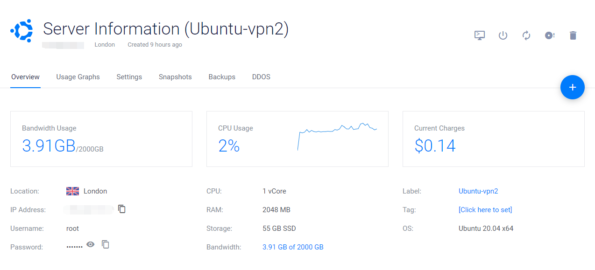
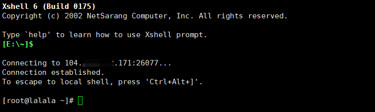
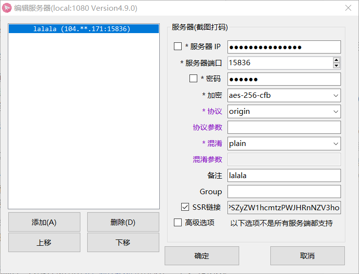
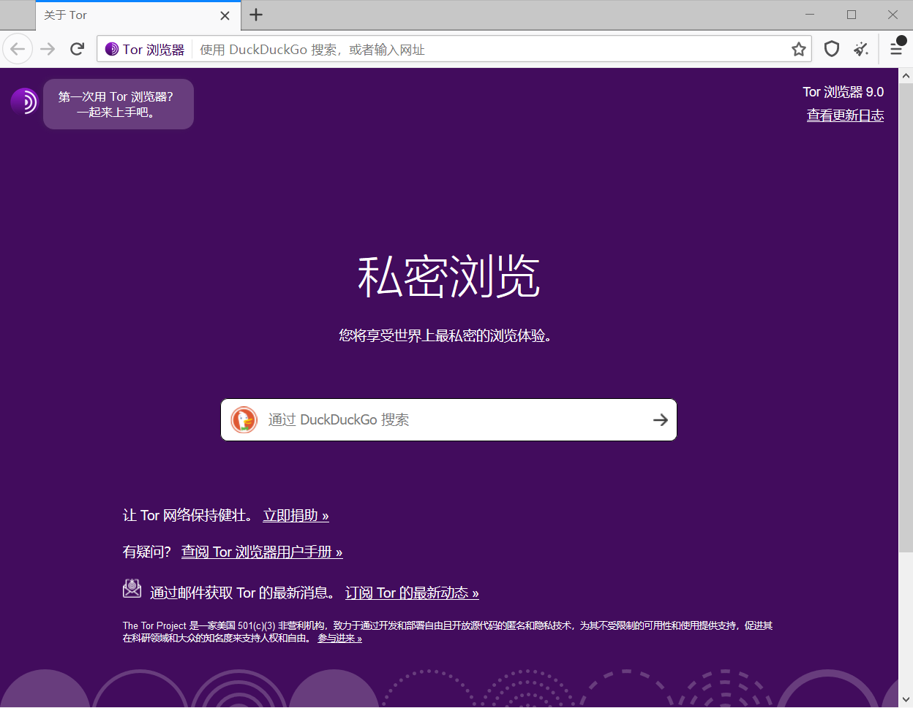

# 使用v2ray,shadowsock及tor

>   v2ray,shadowsock可以代理网络请求，访问墙外网站。


## 目录

-   [v2ray，shadowsock比较](#v2ray，shadowsock比较)
-   [搭建前](#搭建前)
    -   [Vps选购](#Vps选购)
    -   [连接服务器](#连接服务器)
-   [v2ray安装](#v2ray安装)
    -   [客户端](#客户端)
    -   [出现错误](#出现错误)
-   [shadowsock](#shadowsock)
    -   [安装](#安装)
    -   [客户端](#客户端)
-   [tor](#tor)
-   [参考](#参考)


## v2ray,shadowsock比较

相对于shadowsock，v2ray更加稳定安全，不易被墙。推荐使用v2ray。


## 搭建前

### vps选购

vps选购参考https://www.10besty.com/best-vps-hosting-services/

以vulter的云服务器为例(支持微信、支付宝)。vps选购之前需要创建账户，验证支付10美元(65~75rmb)，之后可以挑选服务器安装。vulter的服务器是以小时计费的，每小时/0.01美元，只有在删除服务器以后才停止计费。每月底会从账户余额扣除费用。

安装服务器成功以后需要先尝试ping服务器IP，如果ping不通就新建安装服务器(如果删除当前服务器，半小时以内新建的服务器还是会绑定原来的IP地址)，刷新IP地址。



### 连接服务器

一般云服务器自带网页控制台，不需要连接工具。

xshell是一个终端模拟软件，可用于连接和管理服务器。[Xshell下载](https://xshell.en.softonic.com/)

连接过程：

+   新建
+   输入ip地址及端口号
+   “用户身份验证”，输入服务器用户名密码
+   如果弹出安全警告接受并保存



+   连接成功


## v2ray

### 安装

```
bash <(curl -L -s https://install.direct/go.sh)
```


出现端口和用户id

```
PORT:31040
UUID:c2ffda3e-09be-4a32-b2de-508dca39d42e
```

启动

```
[root@lalala ~]# service v2ray start
Starting v2ray:                                            [  OK  ]
```

查看配置文件

```
cat /etc/v2ray/config.json
```

配置文件中”inbounds”下的这几项信息需要留意：port`端口`、clients中的id`用户id`和alterId`额外id`，它们将在配置客户端时用到。


>   控制 V2Ray 的运行
>   service v2ray start|stop|status|reload|restart|force-reload 
>
>   卸载方法
>   service v2ray stop
>   chkconfig v2ray off
>   rm -rf /etc/init.d/v2ray
>   rm -rf /etc/v2ray (配置文件)
>   rm -rf /usr/bin/v2ray (程序)
>   rm -rf /var/log/v2ray (日志)


### 客户端

Windows：[v2rayN](https://github.com/2dust/v2rayN/releases)

Mac:[v2rayU](https://github.com/yanue/V2rayU)或[v2rayX](https://github.com/Cenmrev/V2RayX/releases)

Android：[v2rayNG](https://github.com/2dust/v2rayNG/releases)

使用大同小异

+   服务器，添加[VMess]服务器
+   输入地址，端口，用户id，额外id，其他默认
+   连接


### 出现错误

安装脚本在创建守护服务的时候不支持CentOS6

```
Error: Nothing to do
Failed to install daemon. Please install it manually.
```


进入目录将/etc/init.d

```
[root@lalala init.d]# vi v2ray
```
下述代码保存为v2ray
```
#!/bin/sh
#
# v2ray        Startup script for v2ray
#
# chkconfig: - 24 76
# processname: v2ray
# pidfile: /var/run/v2ray.pid
# description: V2Ray proxy services
#
 
### BEGIN INIT INFO
# Provides:          v2ray
# Required-Start:    $network $local_fs $remote_fs
# Required-Stop:     $remote_fs
# Default-Start:     2 3 4 5
# Default-Stop:      0 1 6
# Short-Description: V2Ray proxy services
# Description:       V2Ray proxy services
### END INIT INFO
 
DESC=v2ray
NAME=v2ray
DAEMON=/usr/bin/v2ray/v2ray
PIDFILE=/var/run/$NAME.pid
LOCKFILE=/var/lock/subsys/$NAME
SCRIPTNAME=/etc/init.d/$NAME
RETVAL=0
 
DAEMON_OPTS="-config /etc/v2ray/config.json"
 
# Exit if the package is not installed
[ -x $DAEMON ] || exit 0
 
# Read configuration variable file if it is present
[ -r /etc/default/$NAME ] && . /etc/default/$NAME
 
# Source function library.
. /etc/rc.d/init.d/functions
 
start() {
  local pids=$(pgrep -f $DAEMON)
  if [ -n "$pids" ]; then
    echo "$NAME (pid $pids) is already running"
    RETVAL=0
    return 0
  fi
 
  echo -n $"Starting $NAME: "
 
  mkdir -p /var/log/v2ray
  $DAEMON $DAEMON_OPTS 1>/dev/null 2>&1 &
  echo $! > $PIDFILE
 
  sleep 2
  pgrep -f $DAEMON >/dev/null 2>&1
  RETVAL=$?
  if [ $RETVAL -eq 0 ]; then
    success; echo
    touch $LOCKFILE
  else
    failure; echo
  fi
  return $RETVAL
}
 
stop() {
  local pids=$(pgrep -f $DAEMON)
  if [ -z "$pids" ]; then
    echo "$NAME is not running"
    RETVAL=0
    return 0
  fi
 
  echo -n $"Stopping $NAME: "
  killproc -p ${PIDFILE} ${NAME}
  RETVAL=$?
  echo
  [ $RETVAL = 0 ] && rm -f ${LOCKFILE} ${PIDFILE}
}
 
reload() {
  echo -n $"Reloading $NAME: "
  killproc -p ${PIDFILE} ${NAME} -HUP
  RETVAL=$?
  echo
}
 
rh_status() {
  status -p ${PIDFILE} ${DAEMON}
}
 
# See how we were called.
case "$1" in
  start)
    rh_status >/dev/null 2>&1 && exit 0
    start
    ;;
  stop)
    stop
    ;;
  status)
    rh_status
    RETVAL=$?
    ;;
  restart)
    stop
    start
    ;;
  reload)
    reload
  ;;
  *)
    echo "Usage: $SCRIPTNAME {start|stop|status|reload|restart}" >&2
    RETVAL=2
  ;;
esac
exit $RETVAL

```
添加执行权限,开机启动
```
[root@lalala init.d]# chmod a+x v2ray
[root@lalala init.d]# chkconfig v2ray on
[root@lalala init.d]# service v2ray start
```


## shadowsock

### 安装

使用秋水逸冰teddysun的shadowsocks-all.sh一键安装

运行3个命令。

```
wget --no-check-certificate -O shadowsocks-all.sh https://raw.githubusercontent.com/teddysun/shadowsocks_install/master/shadowsocks-all.sh

chmod +x shadowsocks-all.sh

./shadowsocks-all.sh 2>&1 | tee shadowsocks-all.log
```

输入数字选择参数

```
Which Shadowsocks server you'd select:
//选择版本

Please enter password for ShadowsocksR
//设置密码，回车使用默认密码teddysun.com

Please enter a port for ShadowsocksR [1-65535]
//设置端口号，回车使用默认端口

Please select stream cipher for ShadowsocksR:
//选择加密方式

Please select protocol for ShadowsocksR:
//选择协议

Please select obfs for ShadowsocksR:
//选择混淆方式

Press any key to start...or Press Ctrl+C to cancel
//输入任意键安装
```

完成后显示你的各项参数

```
Congratulations, ShadowsocksR server install completed!
Your Server IP        :  104.***.***.171 
Your Server Port      :  15836 
Your Password         :  123456 
Your Protocol         :  origin 
Your obfs             :  plain 
Your Encryption Method:  aes-256-cfb 

Your QR Code: (For ShadowsocksR Windows, Android clients only)
 ssr://MTA0Lj****************jU2LWNmYjpw*********Jmc3BhcmFtPQ== 
Your QR Code has been saved as a PNG file path:
 /root/shadowsocks_r_qr.png 

Welcome to visit: https://teddysun.com/486.html
Enjoy it!

```

>   卸载
>   ./shadowsocks-all.sh uninstall
>
>   启动脚本：启动，停止，重启，查看状态。
>
>   Shadowsocks-Python 版：
>   /etc/init.d/shadowsocks-python start | stop | restart | status
>
>   ShadowsocksR 版：
>   /etc/init.d/shadowsocks-r start | stop | restart | status
>
>   Shadowsocks-Go 版：
>   /etc/init.d/shadowsocks-go start | stop | restart | status
>
>   Shadowsocks-libev 版：
>   /etc/init.d/shadowsocks-libev start | stop | restart | status
>
>   各版本默认配置文件
>
>   Shadowsocks-Python 版：
>   /etc/shadowsocks-python/config.json
>
>   ShadowsocksR 版：
>   /etc/shadowsocks-r/config.json
>
>   Shadowsocks-Go 版：
>   /etc/shadowsocks-go/config.json
>
>   Shadowsocks-libev 版：
>   /etc/shadowsocks-libev/config.json


### 客户端

+   [Windows](https://github.com/shadowsocksrr/shadowsocksr-csharp/releases)
+   [Mac](https://github.com/flyzy2005/ss-ssr-clients/raw/master/ssr/SS-X-R.zip)
+   [Android](https://github.com/flyzy2005/ss-ssr-clients/raw/master/ssr/ShadowsocksR-3.4.0.8.apk)

使用：输入你的ip、端口、密码、加密等参数或输入Your QR Code`SSR连接`



## tor

>   Tor是实现匿名通信的自由软件。其名源于“The Onion Router”的英语缩写。用户可透过Tor接达由全球志愿者免费提供，包含7000+个中继的覆盖网络，从而达至隐藏用户真实地址、避免网络监控及流量分析的目的。

windows:

[下载](http://torproject.lu/zh-CN/download/)

配置-使用代理访问互联网

sock5-127.0.0.1-1080


linux:

>   这里的Tor指的是Tor代理网络，而不是Tor浏览器

```
sudo apt install tor
```
进行配置

```
vim /etc/tor/torrc
```

如果遇到

```
E212：无法打开并写入文件
```

```
sudo vim /etc/tor/torrc
```

在里面添加

```
SOCKSPort 9150                     # socks5代理地址
Socks5Proxy 127.0.0.1:1080         # 科学上网代理地址(如已翻墙可不填)
RunAsDaemon 1                     # 开启后台运行
ControlPort 9151                 # 开启控制端口
```


 



暗网http://zqktlwi4fecvo6ri.onion/wiki/index.php/Main_Page


>   请遵守道德和法律

[@st12138](https://st12138.github.io/)
## 参考

+   https://www.10besty.com/best-vps-hosting-services
+   http://bbs.itzmx.com/thread-89057-1-1.html
+   https://blog.hlogc.com/2019/07/17/centos-install-ssr
+   http://teddysun.com/486.html
+   https://zh.wikipedia.org/zh-cn/Tor
+   http://120.77.176.157/index.php/archives/63.html