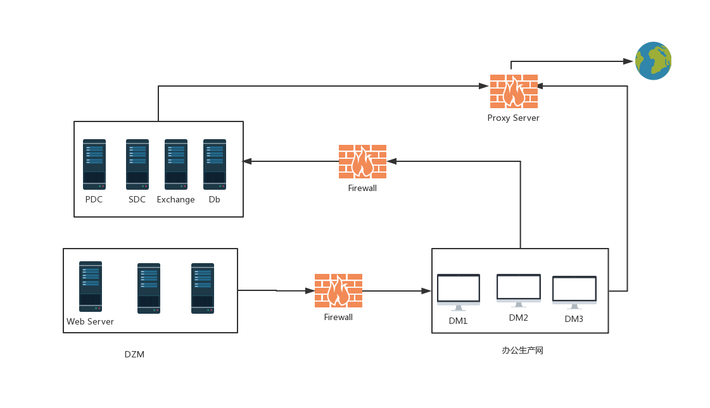

## 域结构

> 大型企业域结构介绍

## 目录

* [单域](#单域)
* [域林]()
* [组织单位]()

## 单域

* DZM: 一般是渗透的起点，一般是面向外网的webserver等。

* 办公网：员工办公电脑所在区域，即dm所在的区域，和DZM区一般进行隔离，只允许单向访问DZM。

* 生产网：一般DC服务器，测试服务器，db等服务器所在的网络，与办公网之间一般进行了ACL。

* 网络出口(Proxy Server)：一般使用TMG(Threat Management Gateway)做透明代理，限制员工访问一些非法网站。